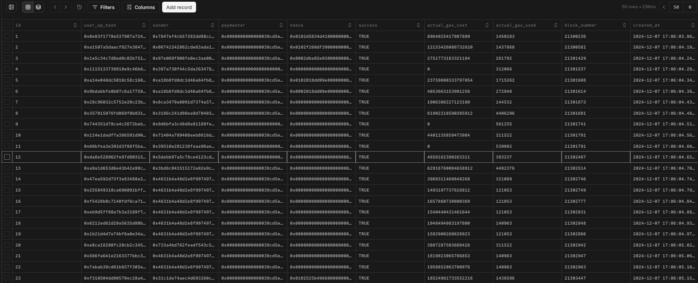
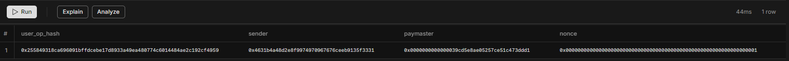
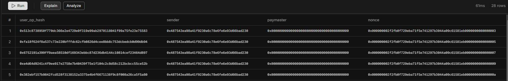
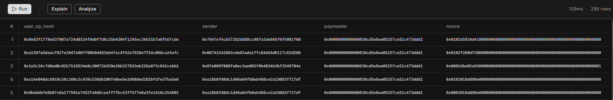
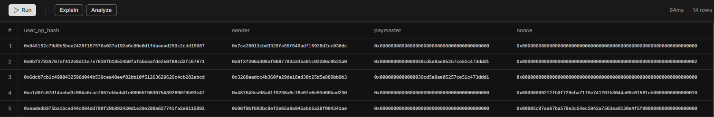
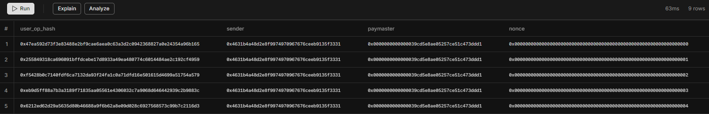

# Running the project
1. Ensure you have rust installed
2. Clone the project
```bash
git clone https://github.com/espieux/user_op_indexer.git
cd user_op_indexer
```
3. Create a .env file at project's root following .env.example template
4. Run the following in your SQL editor
```SQL
CREATE TABLE user_operation_events (
    id SERIAL PRIMARY KEY,                           
    user_op_hash CHAR(66) NOT NULL,                  
    sender CHAR(42) NOT NULL,                        
    paymaster CHAR(42) NOT NULL,                    
    nonce VARCHAR(66) NOT NULL,                   
    success BOOLEAN NOT NULL,                        
    actual_gas_cost NUMERIC(78, 0) NOT NULL,         
    actual_gas_used NUMERIC(78, 0) NOT NULL,         
    block_number BIGINT NOT NULL,                    
    created_at TIMESTAMP DEFAULT CURRENT_TIMESTAMP,  
    CONSTRAINT unique_user_op UNIQUE (user_op_hash, nonce) 
);
```
5. Start the indexer
```bash
cargo build
cargo run
```
Optionally you can set the log level like the following:
```bash
RUST_LOG=DEBUG cargo run
```
Available log levels are:
-  ERROR
-  WARN
-  INFO
-  DEBUG (default)
-  TRACE

# Overview
## Preview of the dataset

## Retrieve user operation details by hash
```SQL
SELECT user_op_hash, sender, paymaster, nonce, success, actual_gas_cost, actual_gas_used, block_number
FROM user_operation_events
WHERE user_op_hash = '0x255849318ca696091bffdcebe17d8933a49ea480774c6014484ae2c192cf4959'; -- Replace with the actual userOpHash
```
### Preview

## User operations for specific sender address
```SQL
SELECT user_op_hash, sender, paymaster, nonce, success, actual_gas_cost, actual_gas_used, block_number
FROM user_operation_events
WHERE sender = '0x487543ea98a41f9230a6c78e6fe6e93d66bad230'; -- Replace with the actual sender address
```
### Preview

## User operations for specific paymaster
```SQL
SELECT user_op_hash, sender, paymaster, nonce, success, actual_gas_cost, actual_gas_used, block_number
FROM user_operation_events
WHERE paymaster = '0x0000000000000039cd5e8ae05257ce51c473ddd1'; -- Replace with the actual paymaster address
```
### Preview

## User operations within specific block range
```SQL
SELECT user_op_hash, sender, paymaster, nonce, success, actual_gas_cost, actual_gas_used, block_number
FROM user_operation_events
WHERE block_number BETWEEN 21300000 AND 21350000; -- Replace with your desired block range
```
### Preview

## Failed user operations with detailed info
```SQL
SELECT user_op_hash, sender, paymaster, nonce, success, actual_gas_cost, actual_gas_used, block_number
FROM user_operation_events
WHERE success = false; -- Replace with `false` if querying for failed transactions
```
### Preview

## Combined query successful operations by specific sender within block range
```SQL
SELECT user_op_hash, sender, paymaster, nonce, success, actual_gas_cost, actual_gas_used, block_number
FROM user_operation_events
WHERE sender = '0x4631b4a48d2e8f9974970967676ceeb9135f3331'
  AND success = true
  AND block_number BETWEEN 21300000 AND 21350000;
```
### Preview

# Workshop: Indexing UserOperationEvent from EntryPoint Contract
**Duration**: 3 heures
**Objectif**: Développer un indexeur pour les événements UserOperationEvent de l'EntryPoint ERC-4337 (address: 0x0000000071727de22e5e9d8baf0edac6f37da032)  (topic: 0x49628fd1471006c1482da88028e9ce4dbb080b815c9b0344d39e5a8e6ec1419f)

## Partie 1: Setup 
1. Créez un nouveau projet Node.js ou rust ✅
2. Installez les dépendances nécessaires ✅

## Partie 2: Connexion à l'Ethereum
1. Créez une connexion à un nœud Ethereum (Infura, Alchemy, etc.) ✅
2. Définissez l'interface de l'événement UserOperationEvent avec les champs suivants: ✅
   ```typescript
   userOpHash: string     // bytes32
   sender: string        // address
   paymaster: string     // address
   nonce: bigint        // uint256
   success: boolean     // bool
   actualGasCost: bigint // uint256
   actualGasUsed: bigint // uint256
   ```

## Partie 3: Implémentation de l'Indexeur 
Implémentez la logique pour:
   - Écouter les nouveaux événements en temps réel ✅
   - Récupérer les événements historiques si un bloc de départ est spécifié ✅
   - Gérer les reconnexions en cas d'erreur ✅
   - Sauvegarder les événements dans la base de données ✅

## Partie 4: Persistance et Requêtes (45 minutes)
1. Créez un schéma de base de données approprié ✅
2. Implémentez dès fonctions pour:
   - Sauvegarder les nouveaux événements ✅
   - Requêter les événements par:
     - userOpHash ✅
     - sender ✅
     - paymaster ✅
     - plage de blocs ✅
     - statut (success) ✅

User interface
- Ajoutez une interface API REST ou GraphQL
- Implémentez un mécanisme de cache
- Ajoutez des métriques et du monitoring
- Créez une interface utilisateur simple (frontend) pour visualiser les userOperations en temps réel

## Critères d'Évaluation
- Qualité et organisation du code
- Gestion des erreurs
- Performance de l'indexation
- Complétude des fonctionnalités
- Documentation
- Tests

## Livrables
1. Code source sur GitHub
2. Documentation d'installation et d'utilisation
3. Un rapport bref expliquant:
   - L'architecture choisie
   - Les défis rencontrés
   - Les optimisations possibles

## Notes Importantes
- Implémentez un mécanisme de reprise après arrêt
- Pour tester votre script, vous pouvez créer un contrat qui émet un userOperation event a votre demande.   
- Gérez correctement les types (u128 / u256 notamment)
- Documentez vos choix techniques

